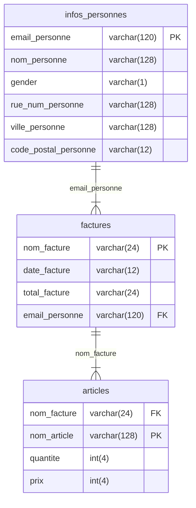

```mermaid
erDiagram
    infos_personnes {
        email_personne varchar(120) "PK"
        nom_personne varchar(128) ""
        gender varchar(1) ""
        rue_num_personne varchar(128) ""
        ville_personne varchar(128) ""
        code_postal_personne varchar(12) ""
    }
    
    factures{
        nom_facture varchar(24) "PK"
        date_facture varchar(12) ""
        total_facture  varchar(24) ""
        email_personne varchar(120) "FK"
    }
    
    articles{
        nom_facture varchar(24) "FK"
        nom_article varchar(128) "PK"
        quantite int(4) ""
        prix int(4) ""
    }
    
    infos_personnes ||--|{ factures : email_personne
    factures ||--|{ articles : nom_facture
    
```